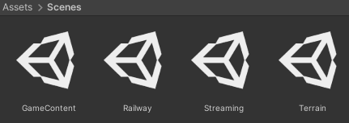

# Project Setup

Before starting, a basic understanding of Unity concepts will be required.

If you need to get more familiar with Unity, [*Code Monkey*][code-monkey] has some great videos to get you up to speed.
In particular, I'd recommend checking out this one:

<iframe width="560" height="315" src="https://www.youtube-nocookie.com/embed/E6A4WvsDeLE" title="YouTube video player" frameborder="0" allow="accelerometer; autoplay; clipboard-write; encrypted-media; gyroscope; picture-in-picture; web-share" allowfullscreen></iframe>

## Installing Unity

To create custom maps, you must install Unity **2019.4.40f1**.
The minor version is essential!
If you don't have Unity installed, the easiest way to get it is through [Unity Hub][unity-hub].

Once installed, click [here][unity-download] to download the correct version.

When asked about modules, you only need to check `Windows Build Support (Mono)` if you're running Linux.
Everything else can be left unchecked.

## Creating The Project

Now that Unity is installed, you can create the project.
In Unity Hub, click "New project" in the top right, and select the "3D" template.
Name your project, select where you want it to be created, and click "Create project."

## Adjusting Settings

Before you begin, you'll also need to adjust some Unity settings.

Firstly, if you're on Linux, you must set the `Target Platform` and `Architecture` to `Windows` and `x86_64`, respectively.
To do this, go to `File > Build Settings`. It may take a minute to change, but it should look like this once it does.

Secondly is the Color Space. To change this, go to `Edit > Project Settings`, then to `Player > Other Settings`, and change `Color Space` to `Linear`.

Third is VR settings so that VR players can enjoy your map too. In that same menu, close the "Other Settings" dropdown, and expand `XR Settings`.
In there, check `Virtual Reality Supported` and set the `Stereo Rendering Mode` to `Single Pass`.
When you're done, it should look like this.

Lastly, you'll need to ensure Gizmos are enabled.
Gizmos are used to render trackage and other previews in the editor.
To toggle Gizmos, click the "Gizmos" button in the top right of the scene view.

## Importing The Creation Package

To import the map creation package, [download the latest release from GitHub][github-releases].
Then, back in Unity, go to `Assets > Import Package > Custom Package` and select the `.unitypacakge` file you downloaded.
When the import prompt comes up, import everything.

## Creating The Required Assets

### Scenes

Mapify requires a unique scene setup to be compatible with Derail Valley.

In your project's `Scenes` folder, create four scenes named `Terrain`, `Railway`, `GameContent`, and `Streaming`.
Each scene has a specific purpose, and you must respect what each scene is for.

- `Terrain`  
  The Terrain scene is strictly for holding terrain.
- `Railway`  
  The Railway scene is only for holding trackage.
  This includes tracks, switches, turntables, and buffer stops.
- `GameContent`  
  The GameContent scene is for holding most functional objects.
  This includes stations, lost & founds, dumpsters, service centers, lights, post-processing, area blockers, and other objects the player will interact with gameplay-wise.
- `Streaming`  
  The Streaming scene is for holding visual-only objects that get streamed in around the player.

You can view and edit all scenes simultaneously by opening one and dragging the others into the hierarchy.

You can delete the default `SampleScene` scene.

### MapInfo

You'll need to create a 'MapInfo' to define some properties about your map, such as its name.
To do this, right-click in the Project window, and go to `Create > Mapify > MapInfo`.
The name doesn't matter, but I'd recommend naming it `MapInfo` for simplicity.

Inside you'll see four properties, each of which should be self-explanatory. Set them as needed.

## Tooltips

Most, if not all, fields on components have tooltips explaining their functionality.
To view them, hover over the field momentarily, and it'll appear.

[unity-hub]: https://unity.com/download
[unity-download]: unityhub://2019.4.40f1/ffc62b691db5
[github-releases]: https://github.com/Insprill/dv-mapify/releases
[code-monkey]: https://www.youtube.com/@CodeMonkeyUnitys
