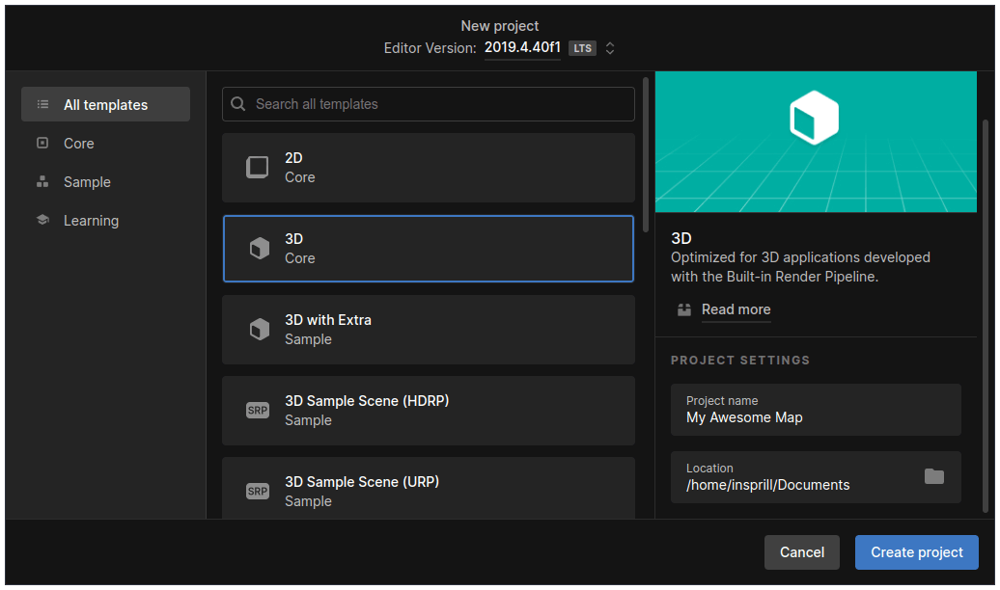

# Project Setup

## Installing Unity

To begin creating custom maps, you'll need to install Unity **2019.4.22f1**.
The minor version is important! 
If you don't have Unity installed, the easiest way to get it is through [Unity Hub][unity-hub].

Once installed you can click [here][unity-download] to begin downloading the correct version.

## Creating The Project

Now that Unity is installed, you can create the project.
In Unity Hub, click "New project" in the top right, and select the "3D" template.
Give your project a name, select where you want it to be created, and click "Create project".

## Adjusting Setting

Before you begin you'll also need to adjust some Unity settings.

Firstly, if you're on Linux, you'll need to set the `Target Platform` and `Architecture` to `Windows` and `x86_64` respectively.
To do this, go to `File > Build Settings`. It may take a minute to change, but once it does, it should look like this.

Second is the Color Space. To change this, go to `Edit > Project Settings`, then to `Player > Other Settings`, and change `Color Space` to `Linear`.

Third is VR settings so VR players can enjoy your map too. In that same menu, close the "Other Settings" dropdown, and expand `XR Settings`.
In there, check `Virtual Reality Supported` and set the `Stereo Rendering Mode` to `Single Pass`.
When you're done, it should look like this.

## Importing The Creation Package

To import the map creation package, [download the latest release from GitHub][github-releases].
Then, back in Unity, go to `Assets > Import Package > Custom Package` and select the `.unitypacakge` file you downloaded.
When the import prompt comes up, import everything.

## Downloading Assets

After importing the map creation package, you'll need to install the free [Bezier Curve Editor][bezier-curve-editor] asset from the Unity Asset Store.
Once you add it to your library, you can click "Open in Unity" to install it.
When you get the importing prompt, ***only*** select the `Editor` folder, and the two scripts inside it.

## Creating The Required Assets

### Scenes
Mapify requires a bit of a unique scene setup to be compatible with Derail Valley.

In your project's `Scenes` folder, create four scenes named `Terrain`, `Railway`, `GameContent`, and `Streaming`.
Each of these scenes have a very specific purpose, and you must respect what each scene is for.

- `Terrain`  
  The Terrain scene is strictly for holding terrain.
- `Railway`  
  The Railway scene is only for holding trackage.
  This includes tracks, switches, turntable, and buffer stops.
- `GameContent`  
  The GameContent scene is for holding most functional objects.
  This includes stations, lost & founds, dumpsters, service centers, lights, post processing, and area blockers.
- `Streaming`
  The Streaming scene is for holding visual-only objects that get streamed in around the player.

You can view and edit all scenes at the same time by opening one, and dragging the others into the hierarchy.

You can delete the default `SampleScene` scene.

### MapInfo
To define some properties about your map, such as it's name, you'll need to create a `MapInfo`.
To do this, right click in the Project window, and go to `Create > Mapify > MapInfo`.
The name doesn't matter, but I'd recommend naming it `MapInfo` for simplicity.

Inside you'll see four properties, each of which should be pretty self-explanatory. Set them as needed.

[unity-hub]: https://unity.com/download
[unity-download]: unityhub://2019.4.22f1/9fdda2fe27ad
[bezier-curve-editor]: https://assetstore.unity.com/packages/tools/11278
[github-releases]: https://github.com/Insprill/dv-mapify/releases
