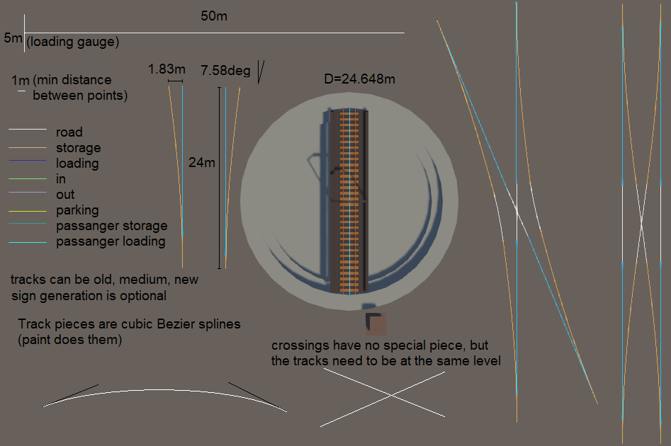

# Railway

Creating trackage may seem complicated at first, but you'll get used to it quickly.

All prefabs mentioned are located in the `Mapify/Prefabs/Trackage` folder.

## Track Tools

Thanks to Wiz, we now have a set of tools to make creating trackage easier.

To access the tools, go to `Mapify` > `Track Tools`.
You can then dock that window wherever you see fit.

## Basic Track

The easiest way to create a track is to use the `Track` prefab.
Grab it and drag it into the scene.

To avoid issues later, unpack the Track prefab.
You can unpack it by right-clicking on it in the scene hierarchy and clicking "Unpack Prefab Completely."
*Only* the `Track` prefab needs to be unpacked.

Each track is made up of a series of points with handles that control how the track will be created between them.
There is currently no way to visualize the actual track in the editor.

On each piece of track, you'll see a `Track` component with a few fields.
Don't worry about those for now. We'll get to them in the [Job Generation](jobs.md) section.

To ensure your track isn't obscured by terrain or other objects, you can toggle `Show Loading Gauge` on the `Track` component.
This will show you the loading gauge overlayed on top of the track.
The loading gauge can be customized in the `MapInfo` object.
The defaults match that of the default Derail Valley map.

## Switches

Switches can be placed using the `Switch Left` and `Switch Right` prefabs.

By default, the switch stand will be placed on the through side of the switch.
You can change this with the "Stand Side" option on the `Switch` component.

Switches *must* have a track attached to all ends.

You *cannot* modify the curves of switches!
Derail Valley switches are a static asset; therefore, you can only use the switch angle they give us.

## Turntables

### The Default Turntable

The default turntable can be placed using the `Turntable` prefab.
To replace any one of the meshes on the default table, remove the `Vanilla Object` component from it and customize the Mesh Filter and Mesh Render as desired.

### Custom Turntables

To create a custom turntable, start by creating a new object and adding the `Turntable` component to it.

Next, as a child, add the `Turntable Control Panel` prefab from the `Components` folder.
If you want to replace the mesh of the shed, remove the `Vanilla Object` component from it and customize the Mesh Filter and Mesh Render as desired.

To make the track, create a new object with a `Track` component and a `Capsule Collider`.
The Capsule Colliders' radius and center should be set to perfectly match the length of your track in the middle.

For the visuals of the table itself, create a new child of the track and set your meshes.
On the `Turntable` component, set the `Bridge` field to this child.

If you want to be able to push the turntable manually, add two objects under the Bridge object,
add Box Colliders to both, and assign them in the `Turntable` component.

## Buffer Stops

### The Default Buffer Stop

To use the default buffer stop, you can drag in the `Buffer Stop` prefab and snap it to the end of a track.

### Custom Buffer Stops

To create custom buffer stops, create a new object with a `Buffer Stop` component.
When added, it'll also add a `Track Snappable` and a `Box Collider`.

To allow the buffer to snap to tracks, create a new child named "Snap Point".
This will be the reference point when snapping to trackage.
On the `Track Snappable` object, set the Reference Point to the "Snap Point" object.

The BoxCollider object is used to detect when a train hits it.
It should be positioned a little in front of the buffer stop itself and about the width and height of the loading gauge.

To allow the buffer stop to interact with train buffers, create a new child called "Compression Point".
This should be positioned at coupler-height, and should be lined up with the front edge of the buffer.
On the `Buffer Stop` component, set the Compression Point to this object.

Lastly, create a new child called "Player Collider" with a `Box Collider` component.
This collider will be used to prevent the buffer stop from spawning inside a train when the game loads,
and as the collider the player interact with.
Back on the `Buffer Stop`, set the Player Collider to this object.

## Locomotive Spawners

There are two types of locomotive spawners that allow locomotives to spawn on tracks naturally,
the `Vanilla Locomotive Spawner` and the `Custom Locomotive Spawner`.

Both spawners function the same way, the only difference being how to set them up in the editor.
The `Vanilla Locomotive Spawner` uses enums to define what locomotives can spawn, making it easy to set up quickly.
The `Custom Locomotive Spawner` uses a list of locomotive IDs, making it compatible with CCL locomotives.

Nothing is preventing you from spawning vanilla locomotives with a custom spawner if you know their ID.

### Station-based vs. Track-based

Locomotive Spawners can be set up in two ways.
Either by adding the component to the same object your `Track` component is on, or the same (or child) object of a `Station` component.

The main difference is, with a station-based spawner, the game will try to spawn you at a station that has a locomotive you're licensed to use
when loading in after cars fail to spawn, such as when trackage is modified between sessions.

### Setup

Locomotive spawners may seem complicated at first, but they're actually quite simple.
Each spawner consists of a list of 'Locomotive Groups', which are themselves a list of locomotives that should spawn.

When the game tries to spawn a locomotive, it'll pick a random locomotive group, then spawn all locomotives in that group in order.
This allows you to spawn pairs of locomotives, such as the S282A (Locomotive) and S282B (Tender).
